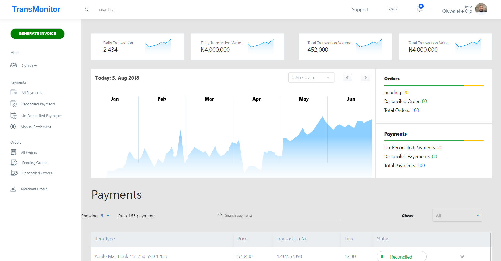

## TRANSMONITOR
[](https://app.netlify.com/sites/transmonitor-dashboard/deploys) 

<a href="https://www.netlify.com">
  
</a>

Site: [TransMonitor DashBoard](https://transmonitor-dashboard.netlify.com/)



Mock up build for the Vela.com.ng Frontend test. Powered by React. 

## Features
* Routers
* Paginations
* Sidebar Toggle
* Responsive Table
* Responsive Layout

## Running the Project
Run yarn install to download and update dependencies
```
yarn install
```

Start the development server
```
yarn start
```

Build and Optimise for Production
```
yarn run build
```

